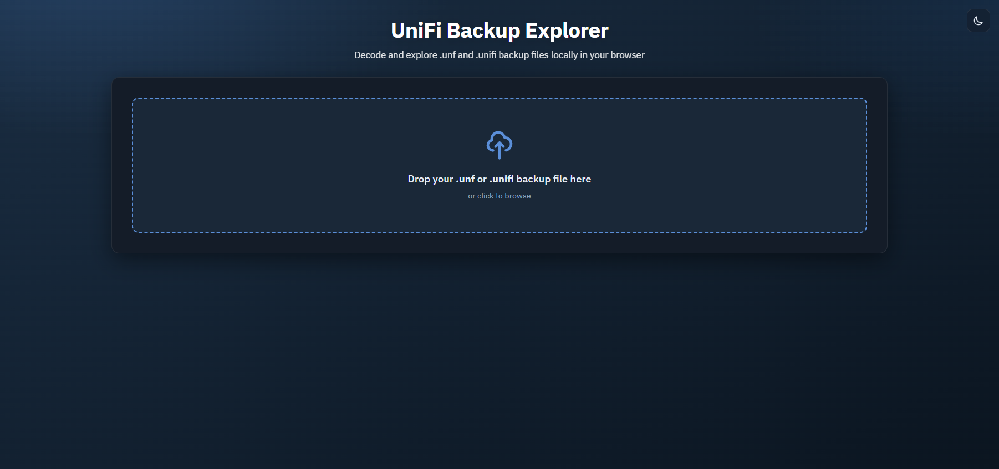
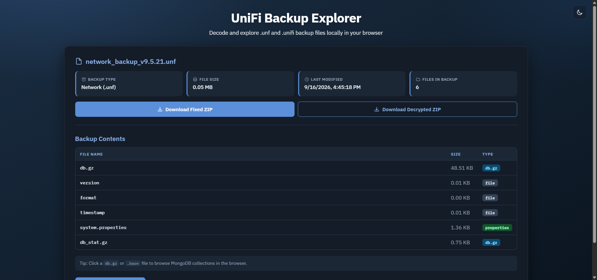
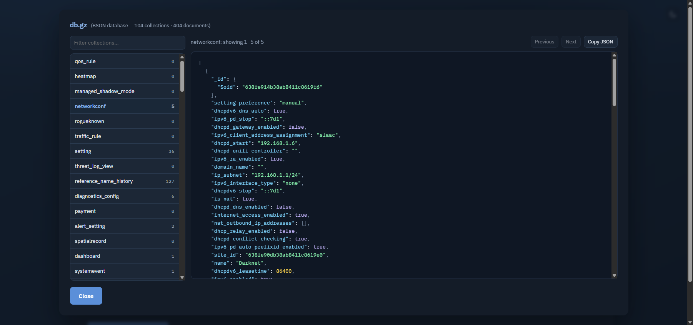
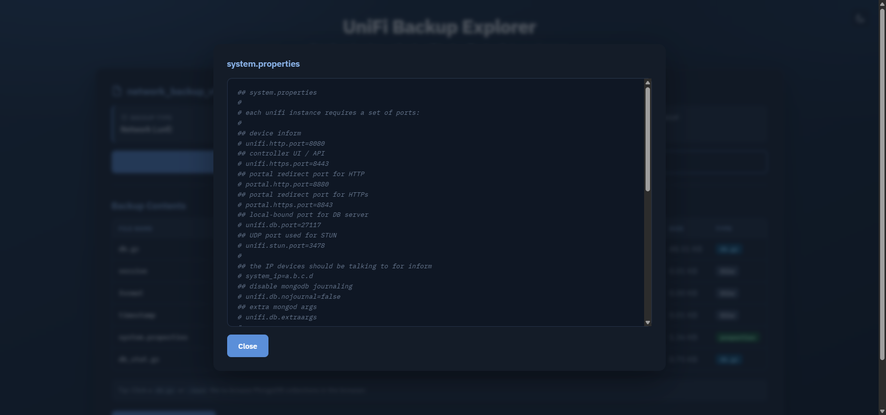
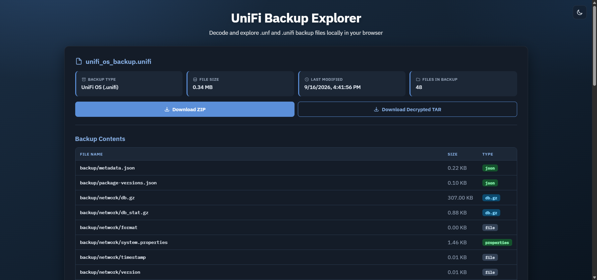
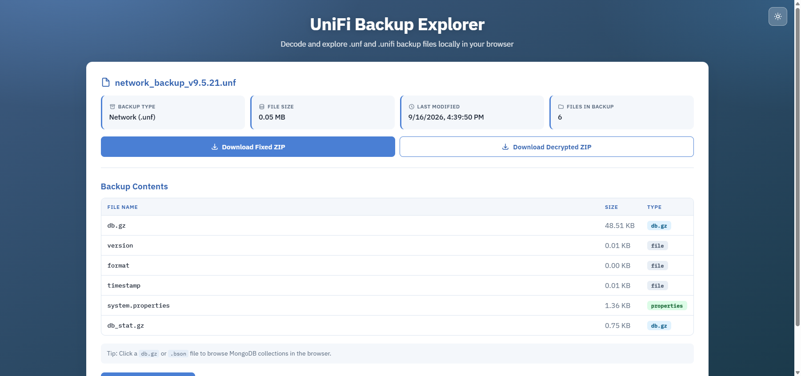
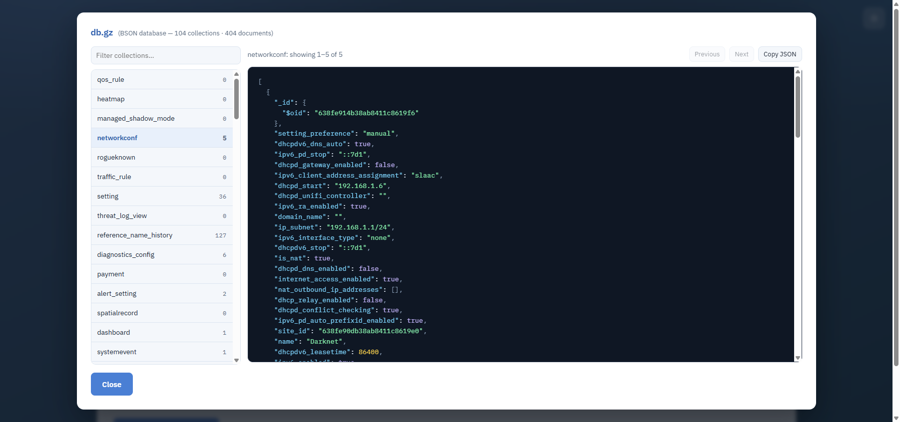

# UniFi Backup Explorer Tool

A pure **clientside JavaScript** tool to decrypt and explore UniFi backup files (`.unf` and `.unifi`) in your browser.



## Screenshots

| Browse decrypted files | BSON collection browser |
| --- | --- |
|  |  |

| File preview | UniFi OS (`.unifi`) backup |
| --- | --- |
|  |  |

| Light theme | BSON browser (light) |
| --- | --- |
|  |  |

## Features

✅ **No server required** - Everything runs in your browser  
✅ **Secure decryption** - Uses hardcoded UniFi AES keys (AES-128 for `.unf`, AES-256 for `.unifi`)  
✅ **File extraction** - Explores ZIP (`.unf`) and gzip+tar (`.unifi`) contents  
✅ **Automatic decompression** - Handles DEFLATE and gzip compression  
✅ **BSON collection browser** - Browse MongoDB dump collections and documents in-browser  
✅ **Syntax highlighting** - Colorized JSON and `.properties` file previews  
✅ **Drag and drop** - Drop `.unf` / `.unifi` files onto the page (full-page overlay)  
✅ **Theme toggle** - Light and dark modes (preference saved in `localStorage`)  
✅ **Session restore** - Last opened backup is cached in IndexedDB and restored on reload  
✅ **Metadata display** - Backup type, size, date, and file count  
✅ **File preview** - View text, JSON, images, properties, and BSON data  
✅ **Download ZIP** - Export decrypted and decompressed backup files  

## How It Works

### `.unf` (Network / site backups)

Encrypted with AES-128-CBC using a static key and IV hardcoded in UniFi software:

- **Key**: `bcyangkmluohmars` (16 bytes)
- **IV**: `ubntenterpriseap` (16 bytes)
- **Mode**: CBC with NoPadding
- **Result**: A ZIP archive containing backup data

### `.unifi` (UniFi OS / console backups)

Encrypted with AES-256-CBC:

- **Key**: `e383b7c53698b36d4baea4ed22181ef73676bfd5d5b90005d9845ffd5dce985f` (32 bytes hex)
- **IV**: first 16 bytes of the file (ciphertext starts at byte 16)
- **Mode**: CBC with NoPadding
- **Result**: gzip → tar archive under `backup/` (network, ucore, users, uos, …)

The tool:
1. Detects `.unf` vs `.unifi` by extension
2. Decrypts with the matching AES key/IV
3. For `.unf`: repairs ZIP structure if needed and extracts files
4. For `.unifi`: gunzips the payload and parses the tar (including GNU long names)
5. Decompresses nested gzip files and converts BSON to JSON
6. Displays file list and metadata with interactive preview
7. Allows downloading a ZIP with all decompressed files

## Supported Backup Versions

Works with UniFi backups from v7.0 and later (likely earlier versions too, as the encryption keys are static and hardcoded).

Tested with: **v9.5.21** (`.unf`) and UniFi OS console backups (`.unifi`)

## Backup Contents

### `.unf` (Network)

Typically contain:

- `db.gz` - Main database (MongoDB BSON, gzipped)
- `db_stat.gz` - Statistics database
- `version` - UniFi version info
- `format` - Format version identifier
- `timestamp` - Backup timestamp
- `system.properties` - System configuration
- `sites/` - Per-site configuration and databases

### `.unifi` (UniFi OS)

Typically contain under `backup/`:

- `metadata.json` - Console backup descriptor
- `network/db.gz` - Network MongoDB dump (gzipped BSON)
- `network/version`, `network/timestamp`, `network/system.properties`
- `ucore/config/*.yaml` - UCore console configuration
- `ucore/database/` - PostgreSQL `pg_dump` files (`toc.dat`, `*.dat.gz`)
- `users/`, `uos/` - Additional subsystem data

## Using the Tool

### Browser Usage

1. Open `backup-explorer.html` in a modern web browser
2. Drop a `.unf` / `.unifi` file onto the page, or click the drop zone to browse
3. Wait for decryption and extraction
4. Browse files and click to preview contents
5. For `db.gz` / `.bson` dumps, use the collection browser (sidebar + document viewer)
6. Click the download button to export all decrypted and decompressed files as a ZIP
7. Use the theme toggle (top-right) to switch light/dark mode

On reload, the last opened backup is restored from IndexedDB when available. Use **Upload Another File** to clear the current session.

### Database Files (BSON)

MongoDB dumps (`db.gz`, `.bson`) open in a collection browser: filter collections, pick one, and page through documents as highlighted JSON. The downloaded ZIP still contains the raw BSON for use with MongoDB tools.

If you need to work with the BSON files directly:

```bash
# Install MongoDB tools (if not already installed)
sudo apt install mongodb-database-tools  # Linux
brew install mongodb-database-tools      # macOS

# Convert BSON database to JSON
bsondump db > backup.json
```

## Technical Details

### Encryption

| Format | Algorithm | Key | IV |
|--------|-----------|-----|----|
| `.unf` | AES-128-CBC, NoPadding | static ASCII 16 bytes | static ASCII 16 bytes |
| `.unifi` | AES-256-CBC, NoPadding | static hex 32 bytes | first 16 bytes of file |

### Decryption Command (OpenSSL) — `.unf`

```bash
openssl enc -d -in backup.unf -out backup.zip -aes-128-cbc \
  -K 626379616e676b6d6c756f686d617273 \
  -iv 75626e74656e74657270726973656170 -nopad
```

### Decryption Command (OpenSSL) — `.unifi`

```bash
# IV is the first 16 bytes of the file; ciphertext is the remainder
IV=$(xxd -p -l 16 backup.unifi)
dd if=backup.unifi bs=1 skip=16 2>/dev/null | openssl enc -d -aes-256-cbc \
  -K e383b7c53698b36d4baea4ed22181ef73676bfd5d5b90005d9845ffd5dce985f \
  -iv "$IV" -nopad | gzip -d > backup.tar
```

### Libraries Used

- **CryptoJS 4.2.0** - AES-128/AES-256 CBC decryption
- **JSZip 3.10.1** - ZIP file parsing and extraction (`.unf`)
- **pako 2.1.0** - DEFLATE and gzip decompression
- **BSON 7.0.0** - BSON to JSON conversion
- **js-bzip2 1.3.8** - Bzip2 decompression support

## Privacy & Security

✅ **No data is sent to any server**  
✅ **All processing happens in your browser**  
✅ **No cookies or tracking**  
✅ **Open source - inspect the code**  

Theme preference is stored in `localStorage`. The last opened backup may be cached in IndexedDB for restore-on-reload; clearing site data removes it.
## Browser Compatibility

Works on any modern browser supporting:
- ES6+ JavaScript
- ArrayBuffer / Uint8Array
- Web Crypto (for CryptoJS)

Tested on:
- Chrome/Chromium 90+
- Firefox 88+
- Safari 14+
- Edge 90+

## Files

- `backup-explorer.html` - Main tool (single HTML file with embedded CSS and JavaScript)
- `README.md` - This file

## Troubleshooting

### "Unable to decrypt .unf / .unifi file"

The decryption uses static keys from UniFi software. If decryption fails:
1. Ensure the file is a valid `.unf` (Network) or `.unifi` (UniFi OS) backup
2. Check the browser console (F12) for error messages
3. The file might be from an unsupported UniFi version (though unlikely)

### "ZIP has structural issues"

The tool automatically handles (`.unf` only):
- Malformed ZIP end-of-central-directory (EOCD) records
- Data descriptors in local file headers
- DEFLATE-compressed files within the ZIP
- Missing central directory entries

If files still don't show:
1. Check the browser console (F12) for detailed error messages
2. The file might be severely corrupted
3. Try with a different backup file

### Cannot view BSON files

The tool parses MongoDB dumps into a collection browser. If this fails:
1. Download the ZIP and use MongoDB tools: `bsondump db > backup.json`
2. Check the browser console for BSON parsing errors
3. The BSON file might be corrupted or in an unexpected format

## References

- [UniFi Backup Decrypt (GitHub)](https://github.com/zhangyoufu/unifi-backup-decrypt)
- [unifi_extract DECRYPTION.md](https://github.com/EvilBit-Labs/unifi_extract/blob/main/DECRYPTION.md)
- [CryptoJS Documentation](https://cryptojs.gitbook.io/)
- [JSZip Documentation](https://stuk.github.io/jszip/)
- [MongoDB BSON Specification](https://bsonspec.org/)

## License

This tool is provided as-is for exploring your own UniFi backups. Respect copyright and only decrypt backups you have permission to access.

---

**Made with ❤️ for UniFi users**  
No warranty - use at your own risk
